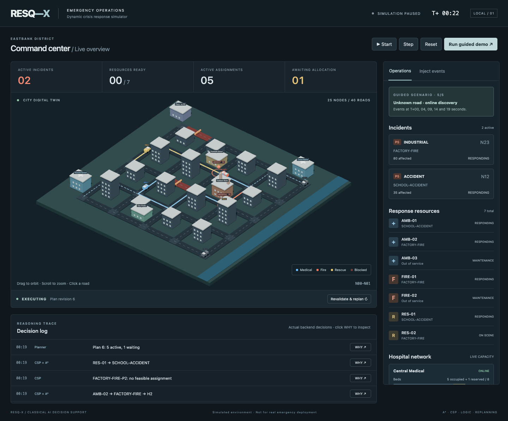

# RESQ-X

**An Intelligent AI Agent for Dynamic Crisis Response**

A runnable classical AI simulation of emergency response in a small city. RESQ-X observes incidents, infers response requirements, allocates scarce vehicles and hospital capacity, routes resources through the road graph, and repairs plans when conditions change. A React / Three.js command center visualizes the same world owned by the Python backend.

**This is a simulated decision-support system for education. It is not an autonomous replacement for real emergency services and must not be used for real dispatch.**



## Problem and objective

The shortest route is only one part of an emergency response. An ambulance also needs to be available, medically compatible, able to reach a patient, and able to deliver that patient to a suitable hospital with a reserved bed. A road blockage or ICU closure can invalidate yesterday's best choice. RESQ-X demonstrates how explicit reasoning, constraints, search, and planning cooperate under these conditions.

## Run locally

Prerequisites: Python 3.11+ and Node.js 22+ with npm. No credentials, paid services, or external AI APIs are needed. The browser needs WebGL; all city geometry is generated locally.

From the repository root:

```bash
python3 -m venv .venv
source .venv/bin/activate
pip install -r requirements.txt
uvicorn backend.main:app --reload --host 127.0.0.1 --port 8000
```

In another terminal:

```bash
cd frontend
npm ci
npm run dev
```

Open **http://127.0.0.1:5173**. API documentation is at **http://127.0.0.1:8000/docs**.

On Windows, activate the virtual environment with `.venv\Scripts\activate`. Use one backend worker: this application deliberately has one authoritative simulation clock and world. Vite proxies `/api` to port 8000. If you change the backend port, update `frontend/vite.config.js`.

SQLite is created automatically at `backend/data/resqx.sqlite3`. To use a different database, set `RESQ_DB` to a file path. The complete snapshot restores on restart, **paused**. Reset clears the current simulation and its persisted history and reseeds the city. No `.env` is required.

`requirements.lock.txt` records the exact Python packages used for verification; install that file instead of `requirements.txt` when you want the same versions. npm uses the committed `frontend/package-lock.json`.

## Demonstrate it

Click **Run guided demo**. The clock advances in half-second simulation ticks.

| Time | Change | What to observe |
| --- | --- | --- |
| 00s | Factory incident, 80 people affected, two critical patients | Rules infer evacuation. CSP assigns one fire truck, one rescue team and two ambulances; A* routes appear. |
| 04s | An active fire-response road is blocked | Barricade appears, PlanValidator rejects the affected route, and its replacement avoids the road. |
| 09s | Central Medical loses its free ICU bed | Hospital reservations are re-evaluated. Scarcity is exposed as a pending patient task. |
| 14s | A school accident adds another patient and rescue requirement | The allocator uses remaining resources and records competition for capacity. |
| 19s | A hidden blockage is introduced on an active route | A vehicle senses its next edge. Online observation updates knowledge and triggers route repair. |

Pause to inspect the routes, use **Step** to advance 0.5 seconds, select an incident to filter its routes, and click **WHY** beside a decision. The explanation includes the actual rule premises, candidate count, rejected alternatives, enforced constraints and selected route. A pending patient after the ICU event is intentional: the planner does not invent capacity. Use **Inject events → +1 ICU bed** before the patient's deadline to make capacity available again.

Manual controls support all six incident types, severity/population escalation, road blocking/reopening, unknown road information, hospital availability and ICU changes, vehicle failure/restoration, and replanning. The search laboratory compares BFS, DFS, UCS, Greedy and A* on the current graph. See [the detailed demo guide](docs/demo_scenario.md).

## Features and AI techniques

- **Real 3D city:** 25 graph nodes, 40 roads, two hospitals, factory, school, shelter, residential blocks, response base, vehicles, incident markers and selectable roads.
- **Custom search:** BFS, DFS, uniform-cost, Greedy Best-First and A*. A* uses a cost-scaled Manhattan lower bound and ignores known blocked roads.
- **Rule inference:** a fact knowledge base and fixed-point forward chaining with rule provenance. Evacuation can imply rescue requirements in a second inference step.
- **CSP allocation:** each response or patient task is a variable; its domain consists of feasible resource/hospital/route combinations. Backtracking, priority ordering, MRV and forward checking enforce resource uniqueness, capability, reachability, capacity, ICU and deadline constraints.
- **Scarcity:** three ambulances, two fire trucks and two rescue teams; one ambulance and one fire truck start in maintenance. Only two ICU slots are initially free.
- **Local improvement:** feasible single-assignment and pair-exchange hill climbing reduces route cost after the CSP establishes feasibility and priority coverage.
- **Dynamic replanning:** valid plans are preserved. Invalid routes, resource failures and capacity changes release affected reservations. A lower-priority response can be preempted when doing so makes a higher-priority task feasible. A working ambulance transporting a patient retains custody during hospital rerouting.
- **Partial knowledge:** hidden road truth is sensed at the next edge, then integrated into the agent's road graph. It is not exposed in the public world-state API.
- **Execution:** backend movement, on-scene service, patient pickup, hospital admission and resource release; frontend interpolates the authoritative position along its current edge.
- **Persistence and explanations:** SQLite snapshots, queryable entity tables, structured events and decision evidence.

There is no trained model, LLM, ML library, or external AI decision service in the backend. Classical AI algorithms are ordinary readable Python.

## Architecture

```text
React + Zustand + React Three Fiber
            │ REST / JSON (500 ms polling)
            ▼
FastAPI → Simulation → WorldState ←→ SQLite
                         │
              Forward-chain inference
                         ▼
           Validate / preserve / invalidate
                         ▼
           CSP backtracking + propagation
                         │ A* candidate routes
                         ▼
             Feasible local improvement
                         ▼
               Execute → observe → replan
```

The frontend owns presentation and selection state. The backend owns all domain state and AI decisions. Simulation mutations are serialized on the application's event loop. See [architecture](docs/architecture.md), [AI algorithms and CSP](docs/ai_algorithms.md), and [presentation notes](docs/viva.md).

## Repository

```text
backend/
  main.py                    FastAPI, input models, endpoints and clock
  simulation/
    models.py                Typed Pydantic domain models
    city.py, graph.py        Deterministic seed and graph representation
    engine.py                Events, execution, observation and demo
  ai/
    search/                  Five searches and online edge discovery
    logic/                   Facts, rules and forward chaining
    csp/                     Domains, constraints, backtracking, propagation
    planning/                Planner, validator, local search, evidence
  database/database.py       Atomic SQLite persistence
frontend/
  src/components/            3D city, event controls, WHY dialog
  src/state/                 Zustand store and polling/mutation ordering
  src/services/              REST client
  src/styles/                Responsive command-center styling
  e2e/                       Browser integration scenario
tests/                       Algorithms, simulation, persistence and API tests
docs/                        Architecture, algorithms, demo and viva material
```

## Verify

From the repository root, with the virtual environment active:

```bash
python -m pytest -q
cd frontend
npm run lint
npm run build
```

For the browser integration test:

```bash
cd frontend
npx playwright install chromium
npm run test:e2e
```

The browser test starts a backend and Vite if they are not already running, walks through the demo and event controls, checks a rendered WebGL canvas and WHY explanations, checks mobile overflow and browser errors, and writes screenshots under `artifacts/`. **It resets the simulation on ports 8000/5173**, including an existing local server on those ports. Stop your own demo before running it. Its own backend uses `/tmp/resqx-browser-test.sqlite3`.

The backend suite covers all searches, weighted optimality, blocked/unreachable routes, fixed-point inference, backtracking recovery, propagation, capacity, priority competition, local pair improvement, hospital reassignment, vehicle failure, online discovery, plan preservation, moving-patient custody, persistence and API validation. The full scripted demo checks plan invariants on every tick.

See [the verification record](docs/verification.md) for commands executed and known non-blocking warnings.

## Useful endpoints

| Method | Path | Purpose |
| --- | --- | --- |
| GET | `/world-state`, `/resources`, `/incidents`, `/hospitals`, `/plan` | Authoritative simulation data |
| GET | `/decisions`, `/decisions/{id}/explanation` | Full decision history and recorded evidence |
| GET | `/search?start=N00&goal=N44&algorithm=A*` | Search comparison |
| POST | `/incidents`, `/events/new-emergency` | Create an incident |
| POST | `/events/road-block`, `/events/road-reopen`, `/events/road-unknown` | Road changes |
| POST | `/events/hospital-change`, `/events/vehicle-failure`, `/events/vehicle-restore`, `/events/incident-change` | Resource/environment changes |
| POST | `/replan` | Validate and repair plans |
| POST | `/simulation/start`, `/simulation/pause`, `/simulation/step`, `/simulation/reset`, `/simulation/demo` | Simulation controls |

Example:

```bash
curl -X POST http://127.0.0.1:8000/incidents \
  -H 'Content-Type: application/json' \
  -d '{"type":"MEDICAL","location":"N12","severity":5,"affected_population":3,"patients":1,"critical_patients":1}'
```

## Limitations and future scope

- A small synthetic grid with abstract travel seconds and six seconds of on-scene service, not a calibrated city or triage model.
- Replanning starts at the last reached intersection. A vehicle partway along a newly blocked edge returns visually to that node; no continuous road geometry optimization is claimed.
- Each ambulance transports one patient per task. Rescue evacuations are represented as completed rescue service, not individual citizens walking to shelters. Hospital admissions remain occupied until reset or an explicit capacity/occupancy event; there is no discharge simulator.
- A* is optimal for the known graph and cost model; partial information can invalidate that route later. Greedy/DFS need not be optimal.
- CSP search has a 20,000-node budget and exposes budget exhaustion. Local search is a bounded improvement method, not a global optimality guarantee. Valid equal-priority assignments are deliberately stable; this incremental planner is not a global rescheduler.
- No authentication or distributed workers: bind to localhost for the college demonstration. Persistence is intentionally simple and suited to short educational sessions, not millions of historical events.

Possible extensions include richer road sensing, patient transfer actions, scheduled hospital discharges, shelter capacity, explicit temporal planning and larger benchmark graphs—while keeping the AI explainable.
